# Lab 400: ATP for all items


## Introduction

This lab will show how expand upon Process Automation's capabilities. This lab assumes you have completed 100 - 300. If you are new to integration, please check out [Lab 100](https://github.com/GaryHostt/ATPworkshop).

Click here to learn more about [Process Automation with Oracle Integration.](https://docs.oracle.com/en/cloud/paas/integration-cloud/build-processes.html)
Click here to [learn more about ATP, and how you can try it for free.](https://www.oracle.com/corporate/pressrelease/oow19-oracle-free-tier-091619.html)

## Objectives

•	Create an integration for our rejected products

•	Reconfigure our previous Process to handle a deeper rejected pathway

## Outline

•	Configure our ATP database

•	Create an integration for our rejected products

•	Reconfigure our previous Process to handle a deeper rejected pathway

•	Embed our approval/rejection tasks in CPQ

# Walkthrough

## 1.	Create a connection to our ATP database

Please see my previous lab on creating an integration to your ATP database [](https://github.com/GaryHostt/ATPworkshop/blob/master/Lab200.md)

### Configure our ATP database

You will need to run this SQL Script on your ATP database

```
CREATE TABLE Products (
    ProductID int,
    ProductName varchar(255),
    CreationDate varchar(255),
    Division varchar(255),
    Description varchar(255),
    ApprovalStatus varchar(255)
);

```

## 2. Create the integration

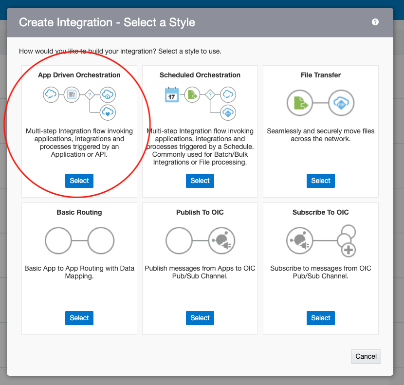

Start by creating an app driven Orchestration

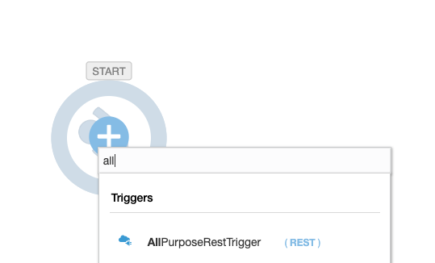

Select your generic REST trigger


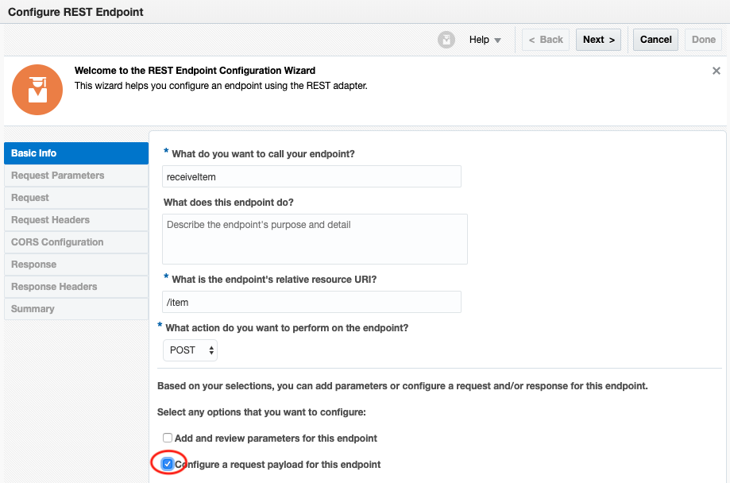

This is how I configured my REST endpoint, but the only thing you need to copy is having the box checked that I have circled. 

Give your endpoint this request payload:
```
{"ProductID":"","ProductName":"","CreationDate":"", "Division":"","Description":"","ApprovalStatus":""}
```


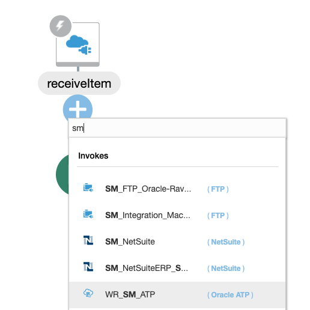

After configuring the REST endpoint, place your ATP connection below. 


Select Perform operation on a table.
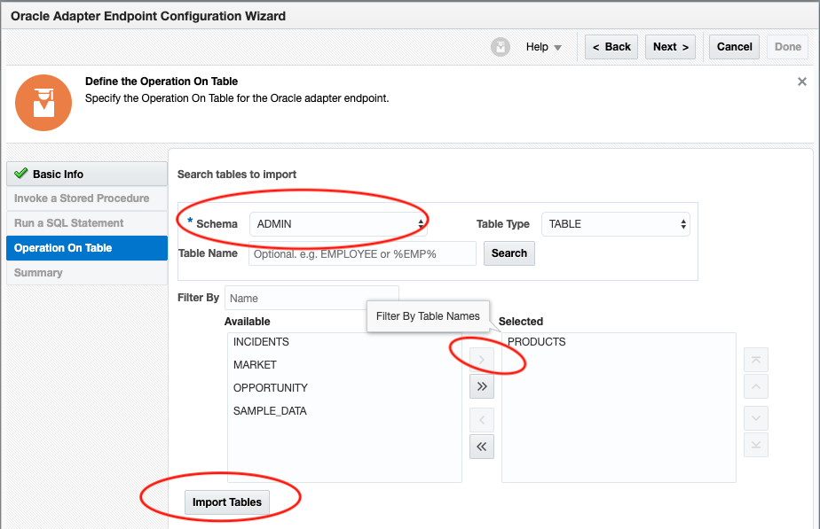

Under schema, select the username you used to create the table. Move the table you created from left to right by pressing the circled arrow. Then press import tables. 
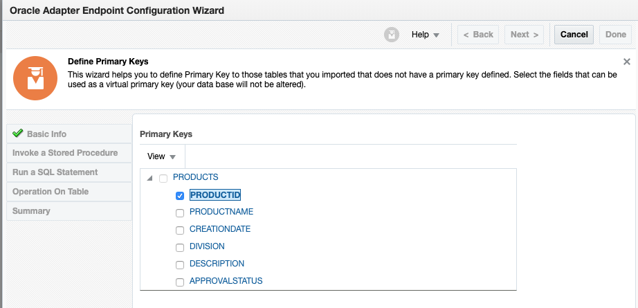

Select Product ID as your primary key.

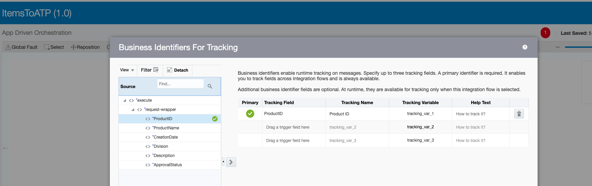

Have ProductID as your business tracker. Activate the integration and return to Process.
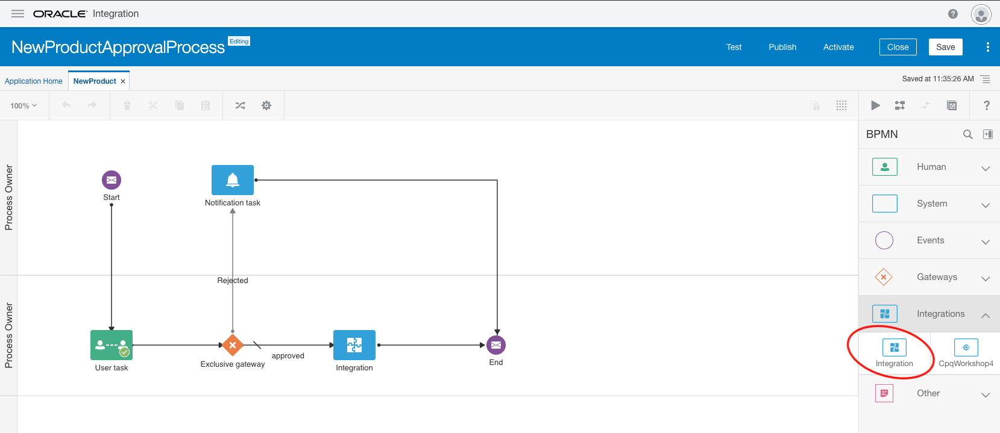

From your process screen, open the palette on the right and drag and drop integration.
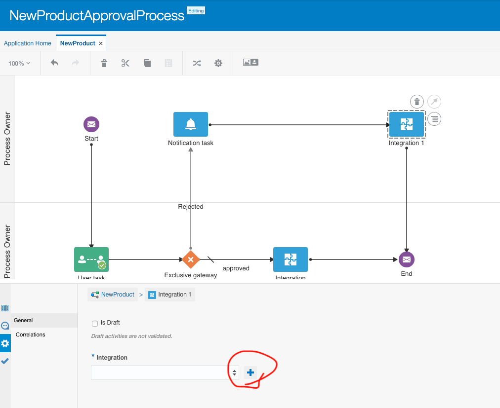

Open the properites. Select your integration by pressing the plus sign.

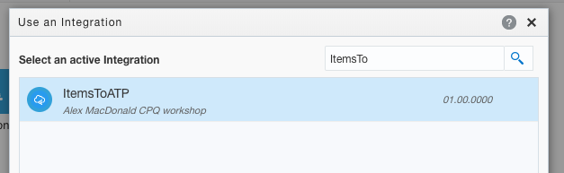

Your environment's integrations should appear, you can filter them with the search box.

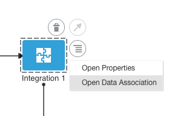

Open the data association for the integration. 

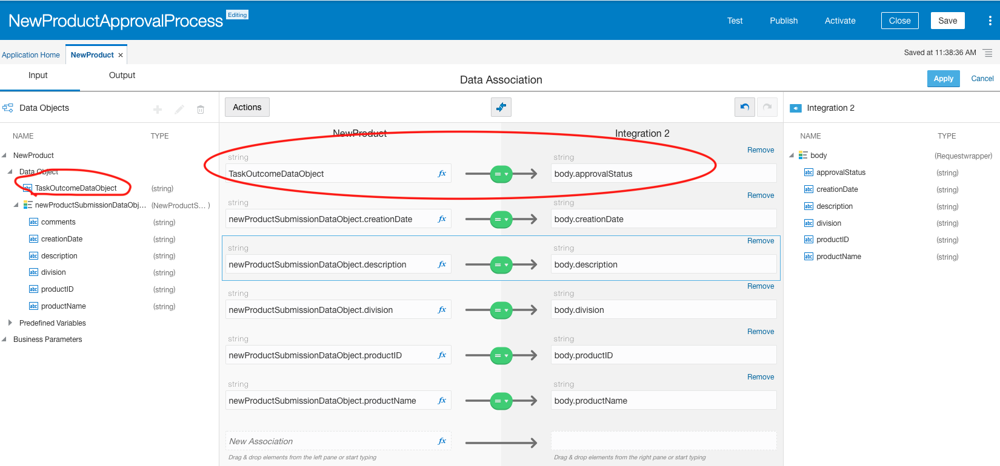

Map the fields from the left to the JSON fields you created earlier. For the approvalStatus field, map the TaskOutcomeDataObject. We will be sending data from Process Automation's output to our ATP database. 

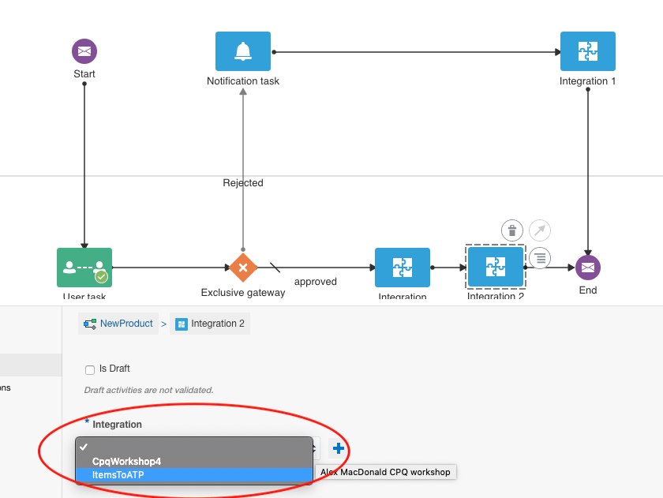

Drag and drop another integration to the approved line. Select the same integration and do the same data association.

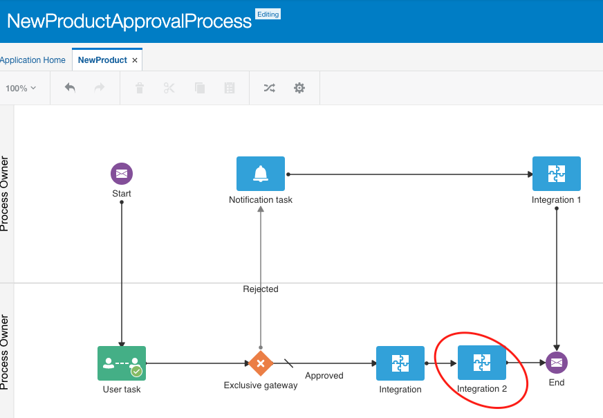

Your business process should now look like this. 
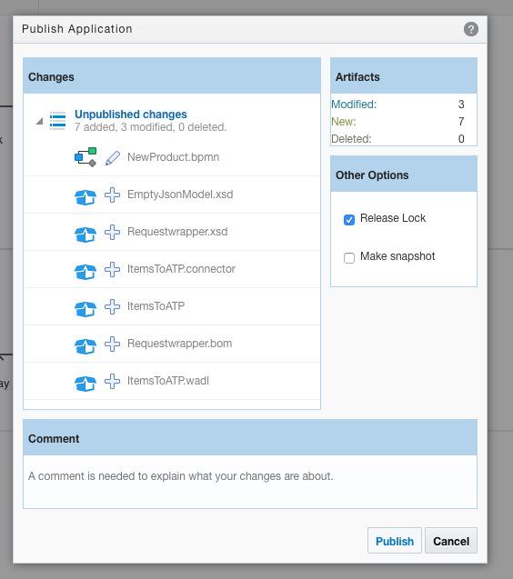

Publish the application.


Activate the application.
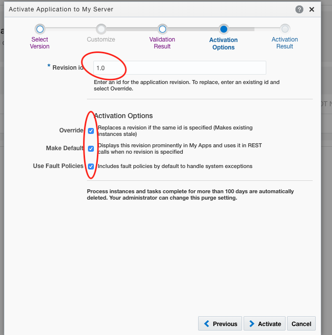

Don't forget to leave the Revision as 1.0 and have all the checkboxes marked.

Congratulations! Your business process will now send your items to ATP, with an indication of wheather or not they were approved. 


